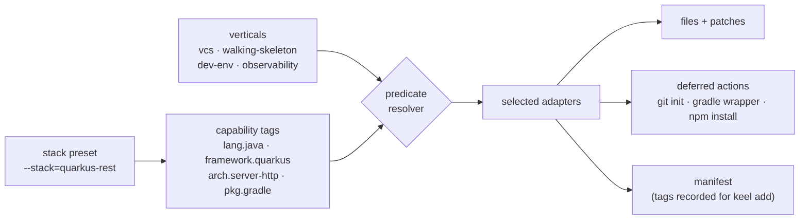

# keel

> One command. A production-shaped, hexagonal walking skeleton — in
> Java, Kotlin, Go, Rust, or TypeScript — that builds, tests, and runs
> end to end before your first commit.

[](https://github.com/rgoussu-dev/Keel/actions/workflows/ci.yml)
[](https://github.com/rgoussu-dev/Keel/releases)

```sh
mkdir my-service && cd my-service
npx @rgoussu.dev/keel new --stack=quarkus-rest
```

Sixty seconds later you have:

- a **hexagonal multi-module project** with the dependency rule laid
  out (`domain/kernel ← domain/contract ← domain/core`),
- a **runnable end-to-end slice** (`GET /greet`, RFC 9457 Problem
  Details errors) with a test driving it,
- a **sample port with its canonical fake** to pattern-match from,
- **git initialised** and the toolchain wired (wrapper generated,
  dependencies resolved),
- the **binding spec emitted as `AGENTS.md`** (plus a `CLAUDE.md`
  pointer), so Claude Code — or any AGENTS.md-aware agent — keeps
  working inside the shape the bootstrap laid down.

keel is **project-scoped only**: it writes into your project directory
and never touches `~/.claude` or any global configuration. The
conventions travel with the code.

---

## Pick your stack

One engine, 24 stacks — the same conventions rendered as idiomatic
Java, Kotlin, Go, Rust, or TypeScript. Pick a cell, run
`npx @rgoussu.dev/keel new --stack=<id>`:

| Language / framework                                                    | CLI                    | HTTP service            | SPA              | Fullstack product     |
| ----------------------------------------------------------------------- | ---------------------- | ----------------------- | ---------------- | --------------------- |
| **Java · Quarkus 3** ([docs](docs/stacks/jvm.md))                       | `quarkus-cli`          | `quarkus-rest`          | —                | `fullstack`           |
| **Kotlin · Quarkus 3** ([docs](docs/stacks/jvm.md))                     | `quarkus-cli-kotlin`   | `quarkus-rest-kotlin`   | —                | —                     |
| **Java · Spring Boot 4** ([docs](docs/stacks/jvm.md))                   | `spring-cli`           | `spring-rest`           | —                | `fullstack-spring`    |
| **Kotlin · Spring Boot 4** ([docs](docs/stacks/jvm.md))                 | `spring-cli-kotlin`    | `spring-rest-kotlin`    | —                | —                     |
| **Java · Micronaut 4** ([docs](docs/stacks/jvm.md))                     | `micronaut-cli`        | `micronaut-rest`        | —                | `fullstack-micronaut` |
| **Kotlin · Micronaut 4** ([docs](docs/stacks/jvm.md))                   | `micronaut-cli-kotlin` | `micronaut-rest-kotlin` | —                | —                     |
| **Go · stdlib** ([docs](docs/stacks/go.md))                             | `go-cli`               | `go-http`               | —                | `fullstack-go`        |
| **Rust · stdlib / axum** ([docs](docs/stacks/rust.md))                  | `rust-cli`             | `rust-http`             | —                | `fullstack-rust`      |
| **TypeScript · node:http** ([docs](docs/stacks/ts-http.md))             | —                      | `ts-http`               | —                | `fullstack-ts`        |
| **TypeScript · web components** ([docs](docs/stacks/web-components.md)) | —                      | —                       | `web-components` | (frontend of all)     |

Every stack page lists its **prerequisites**, the **questions asked**,
and the **exact tree generated** — start at the
[stack catalog](docs/stacks/README.md).

---

## How to

### How to bootstrap a JVM service — Quarkus, Spring Boot, or Micronaut

```sh
npx @rgoussu.dev/keel new --stack=spring-rest   # or quarkus-rest, micronaut-rest, …-kotlin, …-cli
npx @rgoussu.dev/keel new --stack=quarkus-rest --module-layout modulith
```

You get a hexagonal multi-module Gradle-or-Maven project: the domain
trisection (byte-for-byte identical across all three frameworks per
language), an `application` module for the chosen shape (picocli CLI
or REST with `GET /greet`), a `Clock` sample port + fake module, a
Quarkus/Spring/Micronaut test driving the slice end to end, and the
build wrapper generated (`gradlew` / `mvnw`). Every stack has a Kotlin
twin (`…-kotlin`).

Two **module layouts** are on offer. `basic` (the default) is that
flat trisection — the right shape for a single bounded context.
`--module-layout=modulith` carves the same skeleton one context at a
time: `modules/<context>/` holding a whole hexagon
(`user-side/` + `domain/` + `infra/`), `platform/` for what every
context shares, and `application/<typology>` for the runnable
assemblies. Modules meet only at `user-side/service`, which is what
makes extracting a context into its own service a wiring change
rather than a rewrite. Add `--with-peer-context` and you get a second
context to prove it: it reaches the first only through that seam, and
the build graph is what stops it reaching further.
→ [Module layout](docs/stacks/jvm.md#module-layout)

**Prerequisites:** JDK 25, `gradle` _or_ `mvn` on PATH, `git`.
→ [JVM stacks](docs/stacks/jvm.md)

### How to bootstrap a Go service

```sh
npx @rgoussu.dev/keel new --stack=go-http       # or go-cli
```

You get one module in the house Go hexagonal reference: a `cmd/`
directory per deployment unit, `internal/domain` as the contract face
over a compiler-hidden core, a `Clock` port + fake under
`internal/infra/`, and no mediator object — driving ports are
per-use-case interfaces wired explicitly in `main`.

Both Go stacks carry the same **module layout** dial as the JVM ones:
`--module-layout=modulith` puts each bounded context under
`internal/modules/<ctx>/` behind a facade that re-exports nothing, so
"only this context implements its own ports" is a compile error rather
than a review comment. → [Go module layout](docs/stacks/go.md#module-layout)

**Prerequisites:** Go toolchain (`go` on PATH), `git`.
→ [Go stacks](docs/stacks/go.md)

### How to bootstrap a Rust service

```sh
npx @rgoussu.dev/keel new --stack=rust-http     # or rust-cli
```

You get one package in the house Rust hexagonal reference: a
`src/bin/` directory per deployment unit, `src/domain.rs` as the
contract face over a private core module, a `Clock` port + fake under
`src/infra/`, axum + tokio for the HTTP shape (`rust-cli` is
dependency-free), and `cargo check` already run.

`--module-layout=modulith` turns the package into a Cargo workspace,
four crates per bounded context, where a forbidden dependency is a
compile error rather than a review comment. It is the priciest dial
of the five families and the strongest wall — but note that Rust's
peer seam is weaker than the JVM's and Go's: the crate graph stops
you _naming_ a foreign domain type, not one _flowing_ through the
seam, and the enforcement for that does not exist on stable.
→ [Rust module layout](docs/stacks/rust.md#module-layout)

**Prerequisites:** Rust toolchain (`cargo` on PATH), `git`.
→ [Rust stacks](docs/stacks/rust.md)

### How to bootstrap a TypeScript service

```sh
npx @rgoussu.dev/keel new --stack=ts-http
```

You get a no-build-step TypeScript workspace (Node 22.18+ runs the
sources directly): the trisected domain packages behind their
`exports` maps, so a deep import of a handler is a `TS2307` from
`tsc` and an `ERR_PACKAGE_PATH_NOT_EXPORTED` from Node; a registry
mediator behind a `node:http` server; and the `Clock` port + fake in
`infrastructure/clock`.

`ts-http` carries the **module layout** dial too, and here a context
is _one workspace package_ rather than one per layer — because the
package graph enforces nothing on its own (undeclared workspace deps
resolve anyway) while the `exports` map enforces everything. So
`--module-layout=modulith` buys the wall at 1 manifest per context
instead of 3.5, and ships the dependency-cruiser config for the two
rules resolution cannot see.
→ [ts-http module layout](docs/stacks/ts-http.md#module-layout)

**Prerequisites:** Node 22.18+, `npm` or `pnpm`, `git`.
→ [ts-http](docs/stacks/ts-http.md)

### How to bootstrap a frontend SPA

```sh
npx @rgoussu.dev/keel new --stack=web-components
```

You get a framework-free web-components SPA — the browser and the DOM
API as the framework: DOM-less domain packages, custom elements wired
over the WCCG Context protocol, a Vite deployment unit, and an atomic
design-system package on [planks](https://github.com/rgoussu-dev/planks)
layout primitives — installed and ready to `npm run dev`.

The **module layout** dial is here too, and it is the stack whose pull
toward `modulith` is strongest: a browser app is usually multi-context
before its first release, and a micro-frontend _is_ a carved-out
module. A context becomes one workspace package publishing three entry
points — the facade, `./elements`, `./service` — and the design system
stays a top-level package, emitted as an **external** and deduplicated
through an import map in `index.html`, because a package that defines
custom elements has to exist exactly once per page.
→ [web-components module layout](docs/stacks/web-components.md#module-layout)

**Prerequisites:** Node 22+, `npm` or `pnpm`, `git`.
→ [web-components](docs/stacks/web-components.md)

### How to compose a fullstack product

```sh
npx @rgoussu.dev/keel new --stack=fullstack     # or fullstack-spring, -micronaut, -go, -rust, -ts
```

You get two complete keel services — a REST backend and the SPA — as a
monorepo or polyrepo (your choice), wired through the **gateway seam**:
the frontend gains a typed REST gateway package (fetch adapter + fake,
Vite dev proxy), the backend gains CORS for the dev origin, the wire is
pinned by an OpenAPI contract, and monorepo products ship
`compose.yaml` + Dockerfiles.

**Prerequisites:** those of both services; Docker to run the compose
story. → [Fullstack products](docs/stacks/fullstack.md)

### How to grow an existing keel project

```sh
keel add observability        # health probes, correlation ids, OpenTelemetry
keel add containerization     # a thin Dockerfile beside the deployment unit
keel add dev-env              # dev/compose.yaml for local infra

cd my-frontend && keel link ../my-backend   # then `keel add gateway` on both sides
```

`keel …` is shorthand for the installed binary — without an install,
prefix with npx: `npx @rgoussu.dev/keel add observability`.

→ [Verticals catalog](docs/verticals/README.md) ·
[CLI reference](docs/cli.md)

---

## How it composes

The bootstrap is composition, not a template dump. A stack seeds
**capability tags**; **adapters** are selected by predicates over those
tags and contribute files, patches, and deferred actions; **verticals**
bundle adapters and hard-fail if a declared dimension is left
uncovered.



The same machinery composes services into products: each service of a
composite stack records its siblings' **peer tags** (`peer.api.rest`,
`peer.ui.spa`), and cross-service adapters — the frontend gateway, the
backend CORS patch — are ordinary predicate-selected adapters that fire
on them, whatever the peer's language.

→ [Composition model](docs/composition.md) in depth.

---

## Verticals

A vertical is one concern of a project's lifecycle, installed at
bootstrap or layered on later with `keel add`:

| Vertical                                                 | What it adds                                                              | Applies to                        |
| -------------------------------------------------------- | ------------------------------------------------------------------------- | --------------------------------- |
| [`vcs`](docs/verticals/vcs.md)                           | git repo, default branch, optional `origin` remote                        | every stack                       |
| [`walking-skeleton`](docs/verticals/walking-skeleton.md) | the runnable end-to-end skeleton itself                                   | every stack                       |
| [`dev-env`](docs/verticals/dev-env.md)                   | `dev/compose.yaml` — local infra the service needs but does not own       | every stack (default on HTTP)     |
| [`observability`](docs/verticals/observability.md)       | health probes, correlation ids, OpenTelemetry, a Grafana monitoring stack | HTTP services only                |
| [`persistence`](docs/verticals/persistence.md)           | PostgreSQL + Unit-of-Work port + isolated Flyway migrations unit          | every HTTP stack                  |
| [`gateway`](docs/verticals/gateway.md)                   | the cross-service seam: REST gateway + CORS + OpenAPI contract            | peered projects (`keel link`)     |
| [`containerization`](docs/verticals/containerization.md) | a thin Dockerfile beside the deployment unit, opt-in GraalVM native       | HTTP services + SPA               |
| [`distribution`](docs/verticals/distribution.md)         | native CLI binaries cross-compiled and released on tag push               | Quarkus CLI (Gradle) today        |
| [`fullstack`](docs/verticals/fullstack.md)               | product-root glue: README, `compose.yaml` + Dockerfiles                   | composite monorepos (not addable) |

Which verticals are installed by default on which stack, and which can
be added later, is one table in the
[verticals catalog](docs/verticals/README.md).

---

## Documentation

| I want to…                                     | Read                                          |
| ---------------------------------------------- | --------------------------------------------- |
| See every stack, its prerequisites, its output | [Stack catalog](docs/stacks/README.md)        |
| See every vertical and where it applies        | [Verticals catalog](docs/verticals/README.md) |
| Look up a command or flag                      | [CLI reference](docs/cli.md)                  |
| Understand tags, adapters, predicates, peers   | [Composition model](docs/composition.md)      |
| Know the conventions scaffolded projects carry | [Binding spec](assets/project/AGENTS.md)      |
| Hack on keel itself                            | [Development guide](docs/development.md)      |
| See what's next                                | [Roadmap](docs/roadmap.md)                    |

---

## Contributing

Contributions are welcome and flow through **forks**: fork the
repository, branch, keep commits
[Conventional](https://www.conventionalcommits.org/en/v1.0.0/) and
individually green (`pnpm lint && pnpm typecheck && pnpm test`), and
open a pull request against `main`. The full workflow — including how
keel dogfoods its own binding spec — is in
[CONTRIBUTING.md](CONTRIBUTING.md) and the
[development guide](docs/development.md).

---

## Acknowledgments

keel's TDD-first agent and skill methodology is being progressively
informed by
[`citypaul/.dotfiles`](https://github.com/citypaul/.dotfiles) by Paul
Hammond, licensed under MIT. Each file derived from that work carries a
provenance header pointing back to the upstream commit it was lifted
from; the audit trail and the upstream license are kept under
[`THIRD_PARTY_LICENSES/`](./THIRD_PARTY_LICENSES/).

## License

MIT. See [`LICENSE`](./LICENSE). Third-party material under
[`THIRD_PARTY_LICENSES/`](./THIRD_PARTY_LICENSES/).
