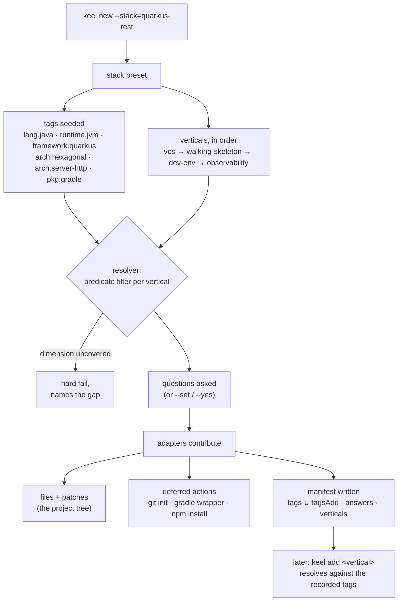
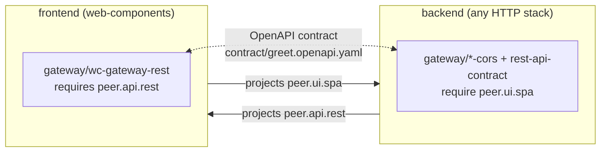

# Composition model

The bootstrap is composition, not a template dump. This page defines
the primitives the engine works with and how they combine — it is the
conceptual companion to the [stack catalog](stacks/README.md) and the
[verticals catalog](verticals/README.md).

## The primitives

### Tags

Flat strings with hierarchical-dot naming — `lang.java`,
`framework.quarkus`, `arch.cli`, `pkg.gradle`,
`runtime.graalvm-native`, `arch.hexagonal`. Tags are **facts about the
project**, captured in the manifest at install time and grown by
adapters that promote new capabilities (via `tagsAdd` — e.g. every
image adapter adds `deploy.container-image`).

### Adapters

The single composable unit. Each adapter declares:

- the tags it **requires** and **excludes** (its `predicate`),
- the **dimensions** of its parent vertical it covers,
- any user **choice points** (`questions`),
- ordering hints (`after`),
- a `contribute()` function returning files, patches, deferred
  actions, agentic bundles, and tags to add.

> Naming note: a _composition adapter_ (`git-init`,
> `quarkus-cli-bootstrap`, …) is keel **domain content** — a unit
> contributing files to a scaffolded project — not a hexagonal adapter
> of keel itself. Those implement `src/domain/contract/ports/` and
> live under `src/infrastructure/`.

### Verticals

Bundles of adapters under one umbrella (`vcs`, `walking-skeleton`,
`observability`, …), each declaring the **dimensions** a valid install
must cover. The resolver verifies every entry in
`vertical.dimensions` is covered by at least one predicate-matching
adapter; an uncovered dimension **hard-fails the install with a
message naming the gap** — that is why `keel add observability` on a
CLI project refuses to half-install (no probe surface to cover).

### Stacks

A stack preset (`keel new --stack=<id>`) is **sugar over a list of
tags + verticals**. Pick `quarkus-cli` and the engine seeds
`lang.java`, `runtime.jvm`, `framework.quarkus`, `arch.hexagonal`,
`arch.cli` (plus the `pkg.*` tag of your build-system choice), then
composes the `vcs` and `walking-skeleton` verticals. `quarkus-rest`
swaps `arch.cli` for `arch.server-http` and the same verticals compose
the REST shape. Adding a stack is a couple of lines in
[`src/domain/core/stacks.ts`](../src/domain/core/stacks.ts).

## One install, end to end

The **manifest** is what makes brownfield growth work: `keel add`
re-runs the same resolution against the tags and answers recorded at
bootstrap, so a vertical added months later composes exactly as it
would have on day one.

## Peer tags and products

Two more primitives compose services into **products**:

### Peer tags

A stack declares the tags it _projects_ onto sibling services —
`quarkus-rest` (like every HTTP backend) projects `peer.api.rest`,
`web-components` projects `peer.ui.spa`. Each project's manifest
records its siblings' projections as `peers`, and adapter resolution
runs against **tags ∪ peer tags**. Cross-service elements are
therefore ordinary predicate-selected adapters: the same
[gateway](verticals/gateway.md) adapter fires for any backend
projecting `peer.api.rest`, whatever its language or framework.

Brownfield, the projection is recorded with
[`keel link`](cli.md#keel-link).

### Composite stacks

A stack may declare `services` instead of scaffolding in place; each
service is a **full stack installed into its own directory** (own
tree, own manifest) with its siblings' projections in scope. The
repository layout (`monorepo`/`polyrepo`) is the user's choice and is
deliberately **not a tag**: no adapter behaves differently by topology
— what varies (where git runs, whether
[product-root glue](verticals/fullstack.md) exists) belongs to the
orchestrator.

## Further reading

- [Stack catalog](stacks/README.md) — every preset and the tags it
  seeds.
- [Verticals catalog](verticals/README.md) — every vertical, its
  dimensions, its adapters.
- [Binding spec](../assets/project/AGENTS.md) — the conventions the
  composed projects carry.
