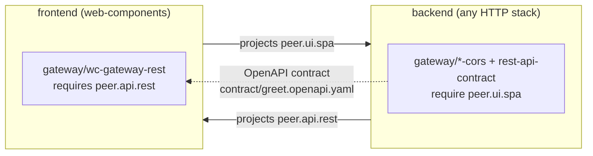

# Composition model

The bootstrap is composition, not a template dump. This page defines
the primitives the engine works with and how they combine — it is the
conceptual companion to the [stack catalog](stacks/README.md) and the
[verticals catalog](verticals/README.md).

## The primitives

### Tags

Flat strings with hierarchical-dot naming — `lang.java`,
`framework.quarkus`, `arch.cli`, `pkg.gradle`, `layout.modulith`,
`runtime.graalvm-native`, `arch.hexagonal`. Tags are **facts about the
project**, captured in the manifest at install time and grown by
adapters that promote new capabilities (via `tagsAdd` — e.g. every
image adapter adds `deploy.container-image`).

### Adapters

The single composable unit. Each adapter declares:

- the tags it **requires** and **excludes** (its `predicate`),
- the **dimensions** of its parent vertical it covers,
- any user **choice points** (`questions`),
- ordering hints (`after`),
- a `contribute()` function returning files, patches, deferred
  actions, agentic bundles, and tags to add.

> Naming note: a _composition adapter_ (`git-init`,
> `quarkus-cli-bootstrap`, …) is keel **domain content** — a unit
> contributing files to a scaffolded project — not a hexagonal adapter
> of keel itself. Those implement `src/domain/contract/ports/` and
> live under `src/infrastructure/`.

### Verticals

Bundles of adapters under one umbrella (`vcs`, `walking-skeleton`,
`observability`, …), each declaring the **dimensions** a valid install
must cover. The resolver verifies every entry in
`vertical.dimensions` is covered by at least one predicate-matching
adapter; an uncovered dimension **hard-fails the install with a
message naming the gap** — that is why `keel add observability` on a
CLI project refuses to half-install (no probe surface to cover).

A vertical also declares **`promotes`**: every tag installing it may
add, the union over its adapters' `tagsAdd` including the ones only
some answers produce (either container-image flavor, every SQL
engine, either CI provider). It exists because a tag promoted at
install time is invisible to anything reasoning _before_ the install,
and something has to: `keel new --with containerization,distribution,iac`
is a legal composition only because `distribution` promotes the
`dist.container-image` tag `iac` is keyed on, so a front door that
checked coverage flatly would refuse the very composition `--with`
exists for (see [`keel new --with`](cli.md#keel-new)). Over-declaring
is safe — it only defers a refusal to the resolver. Under-declaring
would refuse a legal composition, so the installer checks each
contribution's `tagsAdd` against the declaration and throws on a tag
no vertical claims.

### Stacks

A stack preset (`keel new --stack=<id>`) is **sugar over a list of
tags + verticals**. Pick `quarkus-cli` and the engine seeds
`lang.java`, `runtime.jvm`, `framework.quarkus`, `arch.hexagonal`,
`arch.cli` (plus the `pkg.*` tag of your build-system choice), then
composes the `vcs` and `walking-skeleton` verticals. `quarkus-rest`
swaps `arch.cli` for `arch.server-http` and the same verticals compose
the REST shape. Adding a stack is a couple of lines in
[`src/domain/core/stacks.ts`](../src/domain/core/stacks.ts).

### Module layout

A second structural dial beside the build system, carried by a
`layout.*` tag and offered by every stack family except Rust:

| Tag                      | Shape                                                                                                                                                           |
| ------------------------ | --------------------------------------------------------------------------------------------------------------------------------------------------------------- |
| `layout.basic` (default) | the flat trisection — one `domain/` (kernel + contract + core) and one `application/` per entrypoint                                                            |
| `layout.modulith`        | one hexagon per bounded context under `modules/<context>/`, shared plumbing under `platform/`, one runnable assembly per delivery typology under `application/` |

Pick it with [`keel new --module-layout=<id>`](cli.md#keel-new) or
answer the prompt. It is **not** a second set of adapters: the same
adapter id renders a different shape, so the manifest answers, the
`after` ordering and every downstream vertical are unchanged. Adapters
that write outside their own template tree read the paths from
`jvmLayout(tags)` in
[`src/domain/core/adapters/jvm-module-layout.ts`](../src/domain/core/adapters/jvm-module-layout.ts)
rather than naming a directory — that helper is the one place the two
layouts are described.

The dial itself is language-neutral and lives in
[`src/domain/core/adapters/module-layout.ts`](../src/domain/core/adapters/module-layout.ts):
the two layout names, the tags that seed them, and the selectable
options a stack lists in `moduleLayouts`. `jvmLayout` is the first of
its per-language **resolvers** — one per stack family, each owning the
paths and the _name_ derivations (packages, artifact ids, import
prefixes) that its language spells differently from the directory
path. `goLayout` is the second, and the one where names matter most:
Go has no relative imports, so every import line is the module path
concatenated with layout depth and context name, and `goLayout` is the
only place that concatenation happens.

A manifest carrying neither tag resolves to `basic`, so brownfield
`keel add` on a project scaffolded before the dial existed keeps
working unchanged.

> Not to be confused with the composite-stack **repository** layout
> (`--layout=monorepo|polyrepo`) below, which decides how sibling
> _services_ live in version control. Module layout is about bounded
> contexts inside one service; repository layout is about
> repositories.

The modulith's whole point is the **`user-side/service` seam**: a
module that needs a peer declares a driven port in its own vocabulary
and implements it in its own `infra/` over the peer's in-process
service adapter. That is the only dependency edge allowed between
modules, and it is what turns "extract this context into its own
service" into a wiring change. See
[the JVM stack page](stacks/jvm.md#module-layout) for the generated
tree.

## One install, end to end


The **manifest** is what makes brownfield growth work: `keel add`
re-runs the same resolution against the tags and answers recorded at
bootstrap, so a vertical added months later composes exactly as it
would have on day one.

## Peer tags and products

Two more primitives compose services into **products**:

### Peer tags

A stack declares the tags it _projects_ onto sibling services —
`quarkus-rest` (like every HTTP backend) projects `peer.api.rest`,
`web-components` projects `peer.ui.spa`. Each project's manifest
records its siblings' projections as `peers`, and adapter resolution
runs against **tags ∪ peer tags**. Cross-service elements are
therefore ordinary predicate-selected adapters: the same
[gateway](verticals/gateway.md) adapter fires for any backend
projecting `peer.api.rest`, whatever its language or framework.



Brownfield, the projection is recorded with
[`keel link`](cli.md#keel-link).

### Composite stacks

A stack may declare `services` instead of scaffolding in place; each
service is a **full stack installed into its own directory** (own
tree, own manifest) with its siblings' projections in scope. The
repository layout (`monorepo`/`polyrepo`) is the user's choice and is
deliberately **not a tag**: no adapter behaves differently by topology
— what varies (where git runs, whether
[product-root glue](verticals/fullstack.md) exists) belongs to the
orchestrator.

## The toolchain block

The manifest may carry a `toolchain` block — the project's declared
toolchain _needs_, and the contract between keel and the provisioning
engine (roadmap item N): keel records **what** the project requires,
the engine decides **how** to satisfy it.

```json
{
  "toolchain": {
    "schemaVersion": 1,
    "needs": [
      { "tool": "jdk", "version": "25", "source": "jvm-jdk" },
      { "tool": "gradle", "version": "9.4.1", "source": "jvm-gradle-wrapper" }
    ],
    "provider": "mise"
  }
}
```

- **`schemaVersion`** versions the block independently of the
  manifest that carries it. The block is destined to be consumed by
  an external tool once the provisioning engine extracts to its own
  package, so its schema evolves on its own clock; a block written by
  an unknown schema version is rejected loudly, never half-read.
- **`needs`** lists the tools the project requires, one entry per
  tool. `tool` is a **closed vocabulary** covering what the stacks
  require today — `jdk`, `gradle`, `maven`, `go`, `node`, `npm`,
  `pnpm`, `rust` — and growing it is a contract change. `version` is
  spelled the way the project's own files pin it; the optional
  `source` cites the `assets/composition/version-pins.json` entry the
  pin came from, so a registry bump can find every block it should
  touch.
- **`provider`** records the manager choice the provisioning engine
  resolved — one field, even when it names a _combination_
  (`nvm+corepack`): the dial asks one question, so it records one
  answer. Absent until `keel toolchain install` has run once, and
  written by the engine rather than by the vertical, which is why a
  `keel add toolchain --reapply` after a pin bump refreshes versions
  and leaves the choice alone. It is re-validated against the needs
  on every run: a choice the project has outgrown is a loud refusal,
  never a half-install.

An **absent** block means nothing was declared — distinct from a
written block with an empty needs list. The
[`toolchain` vertical](verticals/toolchain.md) writes the block
(`keel add toolchain`, opt-in; `--reapply` refreshes it after a pin
bump — needs upsert by tool, so nothing duplicates), and
[`keel toolchain install`](cli.md#keel-toolchain) consumes it: the
provisioning engine, a bounded context of its own under
`src/domain/toolchain/` that meets the rest of keel only at this
block and the shared ports.

## Further reading

- [Stack catalog](stacks/README.md) — every preset and the tags it
  seeds.
- [Verticals catalog](verticals/README.md) — every vertical, its
  dimensions, its adapters.
- [Binding spec](../assets/project/AGENTS.md) — the conventions the
  composed projects carry.
