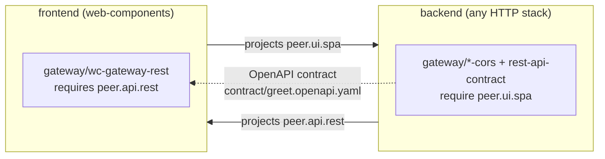

# Composition model

The bootstrap is composition, not a template dump. This page defines
the primitives the engine works with and how they combine — it is the
conceptual companion to the [stack catalog](stacks/README.md) and the
[verticals catalog](verticals/README.md).

## The primitives

### Tags

Flat strings with hierarchical-dot naming — `lang.java`,
`framework.quarkus`, `arch.cli`, `pkg.gradle`, `layout.modulith`,
`runtime.graalvm-native`, `arch.hexagonal`. Tags are **facts about the
project**, captured in the manifest at install time and grown by
adapters that promote new capabilities (via `tagsAdd` — e.g. every
image adapter adds `deploy.container-image`).

### Adapters

The single composable unit. Each adapter declares:

- the tags it **requires** and **excludes** (its `predicate`),
- the **dimensions** of its parent vertical it covers,
- any user **choice points** (`questions`),
- ordering hints (`after`),
- a `contribute()` function returning files, patches, deferred
  actions, [skills](#harness-contributions), and tags to add.

A question's **choices** may carry a `predicate` of their own, in the
same grammar, when only some projects can take them: the persistence
engine's `mariadb` requires `runtime.jvm`, and the migrations tool's
`liquibase` excludes it. A choice is offered exactly where its
predicate matches the tags of the project being asked — the terminal
prompt and `keel.preview` list only those, and a `--set` or an install
body naming another is refused as outside the question's choices
(`keel.invalid-answer`) before anything is written. One function
computes that list (`offeredIn`, in `domain/core/answers.ts`), so what
is offered and what is taken cannot disagree. A choice without a
predicate is offered wherever its adapter runs.

> Naming note: a _composition adapter_ (`git-init`,
> `quarkus-cli-bootstrap`, …) is keel **domain content** — a unit
> contributing files to a scaffolded project — not a hexagonal adapter
> of keel itself. Those implement `src/domain/contract/ports/` and
> live under `src/infrastructure/`.

### Verticals

Bundles of adapters under one umbrella (`vcs`, `walking-skeleton`,
`observability`, …), each declaring the **dimensions** a valid install
must cover. The resolver verifies every entry in
`vertical.dimensions` is covered by at least one predicate-matching
adapter; an uncovered dimension **hard-fails the install with a
message naming the gap** — that is why `keel add observability` on a
CLI project refuses to half-install (no probe surface to cover).

The refusal also says what would close the gap, in the words the
project was picked in rather than the engine's — see
[Refusals](#refusals) below.

A vertical also declares **`promotes`**: every tag installing it may
add, the union over its adapters' `tagsAdd` including the ones only
some answers produce (either container-image flavor, every SQL
engine, either CI provider). It exists because a tag promoted at
install time is invisible to anything reasoning _before_ the install,
and something has to: `keel new --with containerization,distribution,iac`
is a legal composition only because `containerization` promotes the
`deploy.container-image` tag `distribution`'s container adapters
require, and `distribution` the `dist.container-image` tag `iac` is
keyed on, so a front door that checked coverage flatly would refuse
the very composition `--with` exists for (see
[`keel new --with`](cli.md#keel-new)). Over-declaring is safe — it
only defers a refusal to the resolver. Under-declaring would refuse a
legal composition, so the installer checks each contribution's
`tagsAdd` against the declaration and throws on a tag no vertical
claims.

A prerequisite is therefore a **`requires` entry**, never a check
inside `contribute()`: a tag some other vertical promotes, in the
adapter's own predicate. `iac` has always been keyed that way;
`distribution`'s container adapters now are too, on the image
`containerization` builds — which used to be a throw inside their
shared `contribute()` that no menu, no front door and no planner could
see, so distribution was offered everywhere and refused on install.

A union over-offers, though: on a Quarkus CLI the one distribution
adapter that matches builds native binaries, so reading
`distribution`'s union there promises the `dist.container-image` tag
`iac` needs and never delivers it. An adapter therefore may declare
**`promotes`** of its own — its share of the union, which the
registry holds to being inside it and the installer holds its
`tagsAdd` to. `quarkus-cli-native` declares `runtime.graalvm-native`,
the container distribution adapters `dist.container-image`, and the
Go, Rust, TypeScript and SPA image adapters `deploy.container-image`;
the JVM image adapters keep the union, since which flavor they
promote is an answer. An adapter declaring none is read as promoting
the whole union.

A vertical may also declare **`reads`**: the verticals whose presence
its `contribute()` reads, so that when both are in one run it installs
after them. `distribution` reads `persistence` and `observability` —
its deployment descriptor carries `DB_URL` and the OpenTelemetry
variables only when they are there — and `persistence` reads
`observability`. It is a soft edge, not a requirement, and not
`Adapter.after` (which orders adapters within one vertical). The
registry ignores a read of an id nobody registers, and refuses a
cycle.

Both are read by the **planner**,
[`planner.ts`](../src/domain/core/planner.ts): `readiness` says
whether a vertical is _included_ on a scope, _ready_ to install on its
own, _needs_ other verticals first (the smallest such set, in install
order), or is _unavailable_ — with the gap split into a missing
entrypoint, a missing peer and the preset's identity, and the nearest
stacks that do carry it — and `plan` closes a requested set over its
prerequisites and orders it: after whatever feeds a tag its adapters
mention, then after what it reads, then as named. Two equally small
sets of prerequisites (two plugins supplying one capability) are
refused naming both rather than guessed between. A vertical declaring
no dimensions (`gateway`) applies only where some adapter matches, so
with no linked project it is unavailable rather than an install of
nothing.

The planner is the **one reading of readiness**, and every surface
asks it: the extras menu (`keel.dials`, and the terminal's
multi-select) offers what is ready or needs others, labelled with
what it needs, and `keel.dials` lists the rest with the refusal
`keel new --with` gives each; the brownfield cards and `keel add
--list` read it through `keel.project-status`, so `keel ui` groups
them the same way on both halves, before any click; `keel.dials`
snaps a page's extras to their closure,
reporting each vertical it added or dropped and why; `keel new --with`
installs its extras in plan order, whatever order they were named in —
it hands the planner the set by id, so verticals nothing ties together
go in by id and every permutation writes the same bytes; and both
`keel new --with` and `keel add` refuse — before a file
moves — a vertical the scope cannot carry, or a tie between two sets
of prerequisites (`keel.missing-prerequisites`, naming both). A set
missing a prerequisite is **completed** instead: both front doors
install the closure in one run, and the report's first note names
what it added — "added Container image, Distribution — needed by
Infrastructure as code" — the same set `keel.dials` ticks on the page.

After a `keel add`, the planner also **proposes** what the run did not
do: re-rendering an installed vertical whose `reads` names one the run
installed (distribution, rendered before persistence, has no `DB_URL`),
or whose adapters resolve differently on the tags the run left (a
native-only distribution once a JVM image arrives). Proposed, never
done — a re-render overwrites what the vertical owns — and
`keel add … --refresh <ids>` takes it up in the same run, ordered like
any other vertical of the set.

### Refusals

Every refusal of a vertical or a file is **data first**: a `Refusal`
([`refusal.ts`](../src/domain/contract/refusal.ts)), carried by a
`RefusalError` beside its code and the sentence written from it.

| Kind            | Carries                                                                                                                                                  | Raised when                                                                                       |
| --------------- | -------------------------------------------------------------------------------------------------------------------------------------------------------- | ------------------------------------------------------------------------------------------------- |
| `unavailable`   | the vertical, what is `missing` (entrypoint, peer, identity tags), the stacks that carry it, a reason of its own                                         | nothing keel can add makes it install here — or, with `repositoryOnly`, not in a monorepo service |
| `needs`         | the verticals, and each equally small set of prerequisites                                                                                               | two sets would each do — a tie, which is the user's to settle                                     |
| `elsewhere`     | the vertical, and each service with how ready it is there (and, in a monorepo, what only its root may carry, or that the root builds it for the service) | it is asked of a composite product rather than one of its services                                |
| `incompatible`  | the verticals                                                                                                                                            | each installs alone, but no order installs them together                                          |
| `path-conflict` | the file, the adapter, and the block it lacks if that is the conflict                                                                                    | a file the run would write, or patch inside, is in the way                                        |
| `path-missing`  | the file, and the adapter that patches it                                                                                                                | a file the run patches is gone                                                                    |

One builder, [`refusals.ts`](../src/domain/core/refusals.ts), reads
that data as a sentence, and every surface speaks it: the planner's
refusals at both front doors, `keel.dials`' reasons for dropping an
extra, the resolver's last-line throw, `keel add`'s product-root
redirect and `keel new --with` on a composite. The two file sentences
are spelled beside their errors in the contract, because an adapter —
a plugin's too — raises them, and the builder reads them from there.

The sentence is **phase-neutral**: `keel new --with persistence` on
`go-cli` and `keel add persistence` on the project it scaffolds are
refused in the same words under the same code, and the composition
grid's I5 holds every single-service stack to that. It never says
`--with` or `keel add`: the remedy one command has is its front end's,
built from the refusal's fields — the CLI prints it on a `hint:` line
(_drop it from `--with`, or scaffold go-cli-http, which carries it_;
_`keel link <path>` first_; _`cd backend && keel add persistence`_;
_move `go.mod` aside_ before `keel new`, never after, where the file
may be a product root's own), and `keel ui` receives the refusal itself
in the 422 body, as `error.refusal`.

And it **never prints a tag.** A gap is a fact about tags — the unmet
`requires` of the adapter nearest to matching, as `coverageGap` and the
planner compute it — and most of those name something no command can
add. So the sentence sorts it first, naming the vertical by its title:

- an **entrypoint** the project lacks is named by the label the stack
  finder offers it under — _"Observability needs an entrypoint this
  project does not have: HTTP server — a REST endpoint"_;
- a tag the preset fixes at `keel new` (`lang.*`, `framework.*`,
  `runtime.*`, `pkg.*`, `layout.*`, an `arch.*` that is not an
  entrypoint) is an **identity** gap, never offered as a remedy — the
  vertical _"has no adapter for this project's stack"_, followed by
  _"; the nearest stack that carries it: …"_ where a stack of the
  project's shape carries it on the project's dials (never its own
  preset, which does not), or, when only the build system
  differs, _"…has no adapter for this project's build system; it needs
  Maven — …"_ — which an adapter a dial away is read as ahead of one an
  entrypoint away: a Quarkus CLI on Maven is a build system from
  distribution's native adapter, and never meant to have an HTTP
  server;
- a **peer** tag is what a linked project projects, so the gateway
  reads as _"wires linked projects, and no linked project serves it
  here — link one that does first"_;
- any other tag is a **capability** some vertical adds, named by that
  vertical — _"Distribution needs what Continuous integration adds,
  which this project does not have yet"_.

One gap is not about the project at all but about how an installed
vertical was rendered: a Distribution that shipped a Quarkus CLI as
native binaries, before the project had an image, builds none for
Infrastructure as code to deploy, and re-rendered beside a JVM image
it would. `keel add` refuses that as `keel.needs-refresh` — _"Infrastructure
as code needs Container image, then Distribution re-rendered — as it
was rendered, Distribution does not add what Infrastructure as code
needs"_ — rather than as a capability nothing can add, and its hint
names the run that re-renders it: `keel add iac --refresh
distribution`. A re-render rewrites files the user may have edited,
so it is never planned on its own accord (the refusal's `refresh`
field names it).

The tags travel in the refusal's `missing` field, for a front end or an
adapter author that wants the engine's view. When one adapter is a
framework away and another an entrypoint away, the gap is the
entrypoint — the one a sibling preset has — so `distribution` on a
Spring CLI reads as the HTTP server it lacks, not as Quarkus.
`resolveVertical` throws from the same gap, through the same builder, so
the refusal a user runs into and the one a front door shows ahead of
time cannot say different things; only an adapter `after` cycle, which
is an adapter author's bug, is a `ResolutionError` of its own. At a
composite product's root `keel add` reports no gap at all: a root
carries almost no tags, so its nearest adapter is advice for some other
product, and a vertical the root cannot carry is refused as
`elsewhere`, naming the services that can take it — _"Persistence
belongs to a service, not to the product root — it goes in
backend/"_. That, and a monorepo service asked for what only a
repository root reads — _"Continuous integration cannot go in a
monorepo service: its pipeline is read only at the repository root,
which in a monorepo is the product root — per-service pipelines need
the polyrepo layout"_ — are refused under `keel.wrong-scope`: not
here, where `keel.uncoverable-vertical` is not in this project. Where
no service of a monorepo can take the vertical because it needs what
only the repository root may carry, the root's sentence says so, and
ends on the same way forward: _"Infrastructure as code belongs to a
service, not to the product root — none of its services can carry it,
since it needs Distribution, which cannot go in a monorepo service: …
per-service releases need the polyrepo layout"_ (each such service's
`repositoryOnly`, in the refusal's data). Where no service could take
it and those that could have it have it already, it is no refusal at
all: it is there, and the root's add is an Ok that adds nothing —
_"Code style is already there: backend/ and frontend/ have it"_ — the
reading `keel new --with` gives it on the product, from one function
(`plan-refusal.ts`'s `amongServices`) both read, so the two phases
cannot tell the fact apart. Only a re-render of it at the root is
refused, saying where each service has it from: its own install,
re-rendered there — _"… backend/ and frontend/ have it already, and it
is re-rendered there"_ — or the root, which builds it for the service
(`fromProduct`, in the refusal's data). Where the root builds it for
every service that has it, that is no service's and no install of the
root's, and the sentence says so: _"Container image is not installed
at the product root, which builds it for backend/ and frontend/:
nothing to re-render here"_.

A broken rule reads as its reason with its id — _"… (rule
'walking-skeleton/peer-context-needs-modulith')"_ — so it can be looked
up. The one exception is `keel add module` on the flat layout, whose
sentence `keel ui` shows under the tab it disables: the rule's reason
alone, as a sentence of its own, its id in the refusal's `rules`.

### Stacks

A stack preset (`keel new --stack=<id>`) is **sugar over a list of
tags + verticals**. Pick `quarkus-cli` and the engine seeds
`lang.java`, `runtime.jvm`, `framework.quarkus`, `arch.hexagonal`,
`arch.cli` (plus the `pkg.*` tag of your build-system choice), then
composes the `vcs` and `walking-skeleton` verticals. `quarkus-rest`
swaps `arch.cli` for `arch.server-http` and the same verticals compose
the REST shape.

Nothing in a preset is code — `tags` and `projects` are strings, and
every other field references something registered under an id — so the
presets are **data**, in
[`src/domain/core/stack-presets.json`](../src/domain/core/stack-presets.json).
Adding a stack is an entry there.
[`src/domain/core/stacks.ts`](../src/domain/core/stacks.ts) holds the
zod schema that file must satisfy, resolves each id against the
vertical / build-system / module-layout registries at load, and is
where the resolved `Stack` type lives. A malformed document throws; a
preset naming a piece this build does not carry is dropped with a
`PresetProblem` naming it — which is a load-time error for keel's own
file, and will be the ordinary answer once presets can arrive from a
plugin.

### Conflicts

A `predicate` says when a piece **applies**. A `Conflict` says when an
assembly is **illegal** — a combination of tags that must never be
built, and why:

```ts
{
  id: 'walking-skeleton/peer-context-needs-modulith',
  when: ['modules.peer-context'],
  unless: ['layout.modulith'],
  reason: 'a second bounded context needs the modulith layout: …',
}
```

Two shapes cover what pieces need to say. `{ when: ['a', 'b'] }` is a
**mutual exclusion** — legal apart, illegal together.
`{ when: ['a'], unless: ['b'] }` is a **requirement spelled as its
violation** — `a` is illegal unless `b` is there, and more than one
`unless` reads as "unless any of these".

The evaluation is a predicate's, exactly: all of `when` present, none
of `unless`. Same grammar (trailing `*` globs, no bare `*`), same
matcher, opposite polarity.

**Declared by the piece that owns the rule** — the vertical whose
capability is constrained, or the stack whose combination of dials is
— never in a central table. That is what lets a preset or vertical
arriving from outside this repository bring its own rules with it, and
it is why an assembly reads the declarations of every piece coming
together: neither piece alone knows the whole of it.

**Read three times, which is the point.** The engine refuses an
assembly that violates a rule, naming the rule, its reason and the
tags that matched; it filters the same rule out of every menu and
control, so the choice is never offered in the first place; and it
answers `keel.dials` with the values each dial may still take given
the others, which is the same filtering for a front end that has no
question order to hang it on. A rule stated once cannot have those
answers disagree, which is exactly what a hand-written check kept
failing at: `--with-peer-context` used to be offered against the flat
layout and _then_ rejected.

The third reading exists because a form is not a wizard. `keel new`
settles one dial before offering the next, so every menu it draws is
filtered against a complete tag set. `keel ui` shows every dial at
once from a catalog that describes a preset's dials without knowing
which combination the user is on — so the moment a rule names two
dials together, the page would offer a body the install refuses.
`keel.dials` is what closes that: the page posts the target it holds,
gets back one menu per dial plus the target snapped to them, and
renders from that. See [`keel ui`](ui.md#the-dials-are-narrowed-by-the-same-rules).

Concretely, the menus that narrow as answers land. The first five are
the same functions behind both front ends, in `domain/core/dials.ts`;
the last two are brownfield and live with the project status:

| menu                       | filtered by                                                                        |
| -------------------------- | ---------------------------------------------------------------------------------- |
| build system               | some module layout must still complete it legally                                  |
| module layout              | exact — the build system is already settled                                        |
| peer context               | offered only where switching it on stays legal                                     |
| extra verticals (`--with`) | the planner's readiness: ready, or needs others first — coverage, rules and order  |
| the stack drill-down       | presets no setting of their dials can build are absent from all four steps at once |
| `keel add module`          | `canAddModule` — the control is greyed out where adding a context would be illegal |
| `keel add` cards           | the planner's readiness over the project, its installed verticals and their rules  |

A preset is hidden only when **every** setting of its dials is
refused. Anything stricter would take away a preset reachable by
moving a dial.

The last two rows are brownfield rather than menus, and the shape is
the same: `ProjectStatusHandler` answers for a project already on disk
with the function the command's own front door refuses by, and a form
reads the answer before the click. `canAddModule` greys the bounded
context control out, with `moduleRefusal` saying why. Two rules say
the same sentence about two doors, because two different pieces own
them — `walking-skeleton/peer-context-needs-modulith` for the second
context `keel new --with-peer-context` scaffolds, and
`bounded-context/context-needs-modulith` for the one `keel add module`
adds later. Each `keel add` card carries the planner's readiness —
ready, needs others first, or unavailable with the very refusal the
add gives — and a rule reads there as it does at the front door: over
what is installed and what comes in together. A rule an installed
vertical declares binds a newcomer whose tags would break it, exactly
as the newcomer's own rules do, and the install loop holds every such
rule again after each vertical folds in the tags it really added.

#### Four kinds of refusal, and only one of them is a conflict

A `Conflict` is about **tags**. That is the whole test, and it is
narrower than "the command said no" — most of what keel refuses is
not a capability sitting badly with another capability. The kinds, so
the next reader does not re-run the audit:

| kind                   | reads as                                     | lives in                                                                |
| ---------------------- | -------------------------------------------- | ----------------------------------------------------------------------- |
| **tag conflict**       | "capability X cannot sit with capability Y"  | a `Conflict` on the piece owning it                                     |
| **structural fact**    | "this preset/project is not shaped for that" | a check where the shape is known                                        |
| **declared placement** | "this is read only at a repository root"     | `Vertical.placement` / `Adapter.providesInServices`, read by `scope.ts` |
| **capability probe**   | "no adapter here would emit anything"        | `coversFor` / `emitsFor`                                                |

**Structural facts** are the ones that look like conflicts and are
not, because the thing they turn on is not a tag:

- `stack.services` being non-empty is what makes a preset composite,
  and it is why `keel new` refuses `--module-layout` and
  `--with-peer-context` on one, and sends each `--with` extra into a
  service — the one named (`--with backend:persistence`), or the one
  service that can take it — rather than the product root. Those are
  refusals about _flags that do not apply at a product root_, not
  about capabilities — a composite's services can perfectly well each
  be a modulith.
- `manifest.services` being non-empty is the same fact brownfield, and
  why `keel add module` sends the user into a service directory — and
  `keel add` too, for any vertical the planner reads the root as unable
  to carry (`keel.wrong-scope`, naming the services that can), or
  answers that it is there already, where the services that could have
  it have it.
- `manifest.modules` already holding the name, or holding a
  `--consumes` target with no seam, is manifest **state**: it takes a
  name to check, and a name is not a tag.
- An unknown stack or vertical id, `--layout` that is neither
  `monorepo` nor `polyrepo`, a build system the stack does not list,
  `--with` or `keel add` naming the same vertical twice — input
  validation against what the registry declares.

**Declared placements** are the structural fact a vertical brings with
it. A monorepo product's services are directories of one repository,
and nothing in a service's tags says so — only the product root's
manifest does, by listing it. So a vertical whose output only a
repository root reads — `vcs`'s hooks and changelog, `ci`'s pipeline,
`distribution`'s release workflows — declares `placement: { scope:
'repository', because }`, and product glue that builds something inside
its services — the fullstack `compose.yaml`'s images — declares
`providesInServices: { vertical, stacks }` on its adapter, which writes
exactly those. `scope.ts` reads both off the manifests on disk
(`scopeOf`, through `ManifestStore`) and hands the planner a value: in
a monorepo service, the product root's placed verticals and what its
glue builds read as there already, and a placed vertical the root does
not have — or a vertical needing one, `iac` needing `distribution` —
as not for that scope (`keel.wrong-scope`). `keel new` reads the same
placement to leave those verticals out of a monorepo service, so what
it scaffolds and what `keel add` refuses there cannot drift. No tag is
minted for either: the fact is where a directory sits, and a
declaration read by a structural check is the honest home for it.

**Capability probes** ask the adapter set a question no tag answers:
would anything actually be emitted here? `coversFor` and
`coverageGap` ask it of a vertical's dimensions, and the planner of a
vertical's readiness on a scope, with what other verticals would add
(`keel.uncoverable-vertical`, `keel.missing-prerequisites`);
`emitsFor` asks it where a dimension cannot speak, because a context
adapter declares `covers: []` (`--with-peer-context` and
`keel add module` both, see [context-support.ts](../src/domain/core/adapters/context-support.ts)).
A probe is not a conflict even where it sits right beside one: after
the layout rule refuses a context on the flat layout, the probe still
has to ask whether this project's _language_ has a context adapter at
all, and that answer changes when an adapter lands, not when a tag
does.

The rule to hold to: **do not invent a tag so a check can become a
declaration.** A tag exists to select adapters and describe a
project's capabilities; one minted to give a conflict something to
match on describes nothing, and the declaration it enables buys no
second reading — which is the only thing that makes moving a rule
worth doing.

### Module layout

A second structural dial beside the build system, carried by a
`layout.*` tag and offered by every stack family except Rust:

| Tag                      | Shape                                                                                                                                                           |
| ------------------------ | --------------------------------------------------------------------------------------------------------------------------------------------------------------- |
| `layout.basic` (default) | the flat trisection — one `domain/` (kernel + contract + core) and one `application/` per entrypoint                                                            |
| `layout.modulith`        | one hexagon per bounded context under `modules/<context>/`, shared plumbing under `platform/`, one runnable assembly per delivery typology under `application/` |

Pick it with [`keel new --module-layout=<id>`](cli.md#keel-new) or
answer the prompt. It is **not** a second set of adapters: the same
adapter id renders a different shape, so the manifest answers, the
`after` ordering and every downstream vertical are unchanged. Adapters
that write outside their own template tree read the paths from
`jvmLayout(tags)` in
[`src/domain/core/adapters/jvm-module-layout.ts`](../src/domain/core/adapters/jvm-module-layout.ts)
rather than naming a directory — that helper is the one place the two
layouts are described.

The dial itself is language-neutral and lives in
[`src/domain/core/adapters/module-layout.ts`](../src/domain/core/adapters/module-layout.ts):
the two layout names, the tags that seed them, and the selectable
options a stack lists in `moduleLayouts`. `jvmLayout` is the first of
its per-language **resolvers** — one per stack family, each owning the
paths and the _name_ derivations (packages, artifact ids, import
prefixes) that its language spells differently from the directory
path. `goLayout` is the second, and the one where names matter most:
Go has no relative imports, so every import line is the module path
concatenated with layout depth and context name, and `goLayout` is the
only place that concatenation happens.

A manifest carrying neither tag resolves to `basic`, so brownfield
`keel add` on a project scaffolded before the dial existed keeps
working unchanged.

> Not to be confused with the composite-stack **repository** layout
> (`--layout=monorepo|polyrepo`) below, which decides how sibling
> _services_ live in version control. Module layout is about bounded
> contexts inside one service; repository layout is about
> repositories.

The modulith's whole point is the **`user-side/service` seam**: a
module that needs a peer declares a driven port in its own vocabulary
and implements it in its own `infra/` over the peer's in-process
service adapter. That is the only dependency edge allowed between
modules, and it is what turns "extract this context into its own
service" into a wiring change. See
[the JVM stack page](stacks/jvm.md#module-layout) for the generated
tree.

## Harness contributions

How a piece ships **agent-harness elements** — the `.claude/` workflow
kit and the agent-facing documents — with the code it contributes.
These rules are normative for every harness seam; the skill, hook and
owned-region seams below are live.

**Harness elements ride typed, declarative contribution fields — never
bare `files:` entries or ad-hoc patches.** The engine can only refuse,
report, or gate an element it can identify; a skill hidden inside a
`files:` entry is invisible to all three.

Three ownership patterns, with different reapply semantics:

1. **Adapter-owned whole files.** Exactly one adapter of the resolved
   set owns each file; a second claim is a hard refusal naming both
   origins, and `--reapply` rewrites the file pristine. Skills are
   this class.
2. **Owned regions in shared text.** A sentinel-delimited section of a
   document several parties write — the stack section in `AGENTS.md`
   is the standing example. Reapply replaces the owner's own region
   and never touches the user's prose around it. The patch
   _declares_ the region and the engine verifies the claim — see
   [Owned regions](#owned-regions).
3. **Key-addressed settings merges.** JSON settings composed entry by
   entry, each addressed by what it runs — so a reapply finds keel's
   entries where it left them, adds only what is missing, and never
   rewrites the project's own keys. `.claude/settings.json` is this
   class, and the engine writes it for every hook contributor alike.

Whatever the class, a contribution is **owned by exactly one adapter**
(grouped under its vertical). Tags select and parameterize adapters;
they never own content.

### Activation and final realization

`agent-harness` owns the root document, shims and family kit; its baseline
promotes `agentic.harness`. Every single-service preset installs it after
`walking-skeleton`. `keel new --no-agent-harness` removes that membership.
An opted-out assembly refuses plugin stack tags or other verticals that
would activate `agentic.harness`, before staging files.

Every adapter's `skills`, `hooks` and interim `harnessPatches` are collected across
the whole install run. Only the final, local tag set decides whether they
are realized; a peer's tag never activates this project's harness. Without
the tag, one diagnostic reports the total skipped elements, also carried
by install/preview reports for the graphical plan. Domain files,
patches and formatter configurations still install.

`Contribution.harnessPatches` is the interim region-confined patch seam for
code-style's hook format step. Each patch must declare nonempty `regions`,
verified through the same ownership and confinement rules below. Skills,
hooks and patches retain contributor provenance when realized. The pass
stages every whole file first — skills and hook scripts, across all
contributors — then merges the settings, then runs harness patches, so
code-style's format step lands in the family kit's hook whichever
resolved first. Doc sections land after the harness patches, then
the pointers and the root map rows.

Brownfield `keel add agent-harness` re-renders recorded contributors
non-interactively, including the recorded values of repeat questions,
collecting only their harness declarations. Domain files
and deferred actions are untouched. The transient `bounded-context`
vertical is replayed once per manifest module with synthetic add-module
inputs, which are never persisted. The module record retains its `consumes`
peer so replay preserves the context's dependency; older records without
that optional field replay without a consumer. An unavailable plugin contributor
refuses the adoption before anything is committed.

See the [per-contributor catalog](verticals/agent-harness.md#per-contributor-catalog)
for ownership, currently shipped elements and planned seams.

### Skills

An adapter ships a skill as a `SkillSpec` on its contribution —
**content-carrying** (`name`, `description`, optional
`userInvocable`, `body`, optional `supporting` files), a string
literal or something read through `ctx.templates`, never a path for
the engine to resolve later:

```ts
skills: [
  {
    name: 'run',
    description: 'Launch this service in dev mode and probe it end to end. …',
    body: '# Run the service\n\n…',
  },
];
```

The applier validates each spec against its zod schema (refusing a
malformed one naming the adapter), renders it with the one shared
`renderSkill` serializer, and stages it to
`.claude/skills/<name>/SKILL.md` — plus its `supporting` files beside
it — as an adapter-owned whole file. Each staged file gets a
provenance record in the manifest's `entries`: the owning adapter as
`source`, the target path, and the pristine content hashes.

Two rules the seam enforces:

- **The description is the whole trigger.** `renderSkill` emits
  `name` and `description` frontmatter (and `user-invocable` only
  when the spec sets it) and **never `paths:`** — upstream Claude
  Code discovery mismatches path-scoped skills, so description
  matching is what activates a skill. Write the description as the
  trigger, in at most two sentences.
- **`Vertical.skills` declares the complete set.** Every skill name a
  vertical's adapters may stage, including the ones only some answers
  or tag sets produce — the mirror of `promotes`, for the same
  reason: a skill staged at install time is invisible to anything
  reasoning before the install, and a front end reporting what an
  assembly ships needs the static answer. The installer checks each
  contribution's names against the declaration and refuses an
  undeclared one.

**A component ships a skill only for a procedure its own files make
real** — the no-fiction rule, and the reason the `release` skill was
never emitted. What that produces today:

| Skill                 | Owner                                              | Emitted when             |
| --------------------- | -------------------------------------------------- | ------------------------ |
| `run`                 | the family kit                                     | always                   |
| `add-module`          | the family kit                                     | `layout.modulith`        |
| `promote-to-modulith` | the family kit                                     | the flat layout          |
| `migrate`             | `persistence` (the migrations adapter of the dial) | persistence is installed |
| `deploy`              | `iac`                                              | iac is installed         |

The first pair is exhaustive and exclusive: a project has one layout,
so exactly one of the two ships, and a scaffold carrying both would
read as two contradictory procedures. `migrate` and `deploy` are
absent until the vertical that makes them real is layered, and the
tests assert the absence as well as the presence — a rule with no
negative is an intention.

A plugin's verticals ship skills through exactly this seam — same
schema, same serializer, same collision refusal and provenance, no
special case. See [Plugins](plugins.md#skills).

### Hooks

An adapter ships a Claude Code hook as a `HookSpec` on its
contribution — content-carrying like a skill: the script, the event it
runs on, the reminders it may feed back into the agent's context, and
the **slots** other contributors own inside it:

```ts
hooks: [
  {
    name: 'pre-commit-format',
    event: 'PreToolUse',
    matcher: 'Bash',
    script: renderPreCommitHook(family),
    reminders: [`pre-commit-format: '${verify}' failed. Fix it before committing.`],
    slots: [FORMAT_STEP_REGION],
  },
];
```

The engine validates the spec (`HookSpecSchema`, refusing a malformed
one naming the adapter), stages the script to
`.claude/hooks/<name>.sh` as an executable adapter-owned whole file,
and wires it into `.claude/settings.json` itself — one entry per hook,
running `<shell> .claude/hooks/<name>.sh`. The rules the seam enforces:

- **One owner per name, declared on the vertical.** A hook name two
  adapters of a run contribute is refused (`hook-collision`) naming
  both; `Vertical.hooks` lists every name the vertical may stage and
  the installer refuses an undeclared one — the mirror of `skills`.
- **A hook is a shell script and assumes no runtime.** The script's
  first line is a `sh` or `bash` shebang, and it invokes no Node,
  `npx`, `jq`, Python, Deno or Bun: a scaffolded Go, Rust or JVM
  project cannot count on any of them. keel's own hooks parse as
  POSIX `sh` too.
- **Reminders are a budget.** A project realizes at most five across
  all of its hooks (`HOOK_REMINDER_BUDGET`); a run over it is refused
  (`reminder-budget`) before anything is staged, naming each
  contributor's share. keel's own hooks spend at most three, leaving
  two for plugins — a guard test holds every stack to it. Two are
  spent today: the pre-commit gate's refusal, and the diff-size
  habit hook's nudge.
- **A gate refuses; a habit hook reminds.** The two shipped hooks are
  one of each, and the distinction is the seam's. `pre-commit-format`
  is a gate: it stops a `git commit` that would not be green.
  `diff-size` is a **habit** hook: after an edit it counts what is
  uncommitted and, once per threshold crossed, says so — reinforcing
  the Chain-of-Small-Steps working agreement mechanically, because
  prose in a root document does not survive context rot. A habit hook
  fires once per band rather than once per edit, and stays silent
  wherever it cannot honestly answer; one that breaks a session is
  worse than no habit hook at all.
- **Slots survive a reapply.** `--reapply` rewrites the script
  pristine around what each declared slot holds on disk, so the
  format step `code-style` wired in stays; a harness patch declaring
  that region is what writes it.
- **The settings file is the project's.** The engine merges keel's
  entries into whatever the file holds, returns it byte for byte when
  nothing is missing, and attributes the file's provenance to
  `keel:engine`. Each hook is its own entry, so it can be turned off
  on its own: list its name under `env.KEEL_DISABLED_HOOKS`
  (comma-separated) and every later apply leaves it unwired and
  removes keel's entry for it. The script itself stays staged, so the
  slots other verticals patch keep a target.

A plugin's verticals ship hooks through exactly this seam. See
[Plugins](plugins.md#hooks).

### Per-directory docs

The context that belongs to one directory lives in that directory: a
short `AGENTS.md` beside the code it is about, and a one-line
`CLAUDE.md` pointer (`@AGENTS.md`) beside it. An adapter contributes a
**section** of such a doc as a `DocSection` on `Contribution.docs`:

```ts
docs: [
  {
    directory: 'domain',
    section: 'layer',
    description: 'the contract face — commands, ports, the Clock port and its fake',
    body: '## domain/\n\n…the commands, the wiring file, the silent failure…',
  },
];
```

The engine validates the spec (`DocSectionSchema`: a relative
directory that is not the root, a kebab-case section, a one-line
description), then:

- **lands the section as an owned region** of `<directory>/AGENTS.md`
  (`<!-- keel:<section>:begin -->`), seeded with `docSeed(directory)` —
  a function of the directory alone, so contributors compose one doc
  in any order and a reapply re-renders each section in place. The
  one-owner rule of [owned regions](#owned-regions) holds: a section
  two adapters of a run declare on one directory is refused naming
  both, and no transform may touch another's section or the project's
  notes around them;
- **writes the pointer** beside every doc that has none, attributed to
  `keel:engine`; a pointer the project already has is left as it is.
  Claude Code lazy-loads only nested `CLAUDE.md` files and resolves an
  import relative to the importing file, so the pointer pulls its
  sibling in exactly when files in that directory are touched; the
  agents that read nested `AGENTS.md` natively need no pointer;
- **projects a row per doc into the root `keel:map` slot**, under the
  engine's own identity, so an agent that never auto-loads nested
  files (Codex, Gemini CLI, Zed, opencode) still reaches every doc
  from the root — see [the navigation index](#the-navigation-index)
  below. A section may also declare `indexes: 'modules'`, marking the
  directory the project's bounded contexts live in so the index
  projects a row per context beneath it; the family kit owns that
  layout, and the projection reads the declaration rather than
  carrying five path prefixes of its own.

Docs realize in the same final harness pass as skills and hooks, after
the harness patches, and only under `agentic.harness`. What a section
may carry is held to one rule, **noise cancellation**: the real
commands, the wiring file's path, the silent failure the layer is known
for — anything an agent could derive from the tree does not ship.

### The navigation index

The rows an agent orients by are a **projection**, not a document
anyone maintains: `keel docs sync|check` (and every install, in its
own apply) recomputes them from the manifest and the resolved
registry and writes them into three engine-owned regions —
`keel:map` and `keel:skills-index` in the root `AGENTS.md`,
`keel:children` in a nested one that has documents beneath it — whose
rows are relative to that document, since that is how markdown
resolves a link. Every
row reads `- [Title](href) — description`.

The map's rows come from three declarations, never from a walk of the
tree: a contributor's `DocSection` (a documented directory), the
manifest's `modules[]` beneath the directory a section declared
`indexes: 'modules'` (a bounded context), and the manifest's
`services[]` (a service of a composite product, pointing at that
service's own root document). A single-service project records no
services, so the third contributes nothing there — which is what keeps
the product root a declaration rather than a branch. See
[`fullstack`](verticals/fullstack.md#the-product-roots-harness).

Three rules the projection holds to:

- **Only what has architectural identity is indexed.** Directories
  with a document, bounded contexts, a composite product's services,
  skills — things keel or an
  architectural action creates and names. The long tail (function
  bodies, call sites, literals) is not, and will not be: it has no
  stable identity, so a shipped index of it would lie within days.
- **A skill's row is its own description, verbatim.** The row and the
  frontmatter come from one `SkillSpec.description`, and a sweep over
  every emitted stack holds them byte-identical — two spellings of one
  trigger is exactly the drift the index exists to prevent.
- **An install merges, a sync replaces.** An install realizes only the
  contributors that ran, so it lays its rows over the ones already
  there and drops none; a row several contributors may describe (a
  directory's) keeps the description the first section gave it. `keel
docs sync` recomputes the set outright, which is what prunes a row
  whose subject is gone.

Full reference, including what `check` reports and how it is wired
into CI: [`keel docs`](cli.md#keel-docs).

### Owned regions

A patch on a file several parties write owns one or more **regions**
of it — each a sentinel pair, `keel:<owner>` between the comment
delimiters of the file's syntax — and says so on
`ContributionPatch.regions`. The usual patch owns exactly one; build
it with `regionPatch`, which takes the region, the body that goes
between the markers and, for a shared file no one may have created
yet, the `seed`:

```ts
import { hashRegion, regionPatch } from '@rgoussu.dev/keel/plugin';

patches: [
  regionPatch({
    target: '.editorconfig',
    seed: 'root = true\n',
    region: hashRegion('code-style'),
    body: '[*.acme]\nindent_size = 2',
  }),
];
```

`upsertRegion` is the transform behind it — replace the section
between the markers when both are present, land a fresh one (after
the content by default, `prepend` for a block that reads first,
`keep` for a slot that must already exist) when neither is, and
refuse with the fix when one marker survives without the other. It is
its own fixed point, which is what lets `--reapply` re-render a region
in place. The stack section of `AGENTS.md`, the format step of the
pre-commit hook, the `code-style` blocks of `.editorconfig` and
`.gitattributes` and the two verticals' regions of `.gitlab-ci.yml`
all run through it.

Declaring a region is a claim, and **the engine verifies it on every
apply** rather than trusting the adapter:

- **Confinement.** The transform may change nothing outside its
  declared regions. One that did is refused (`region-escape`) naming
  the adapter, the file and the region. A region the file already
  carries is compared in place, so whitespace beside it is content
  like any other; the file's own edges are forgiven only when the
  transform landed a fresh region, since that moves the last newline.
  A region the file carried must survive: a transform that removes
  it is an escape, while a `whenAbsent: 'keep'` patch leaving a
  markerless file markerless is not.
- **One owner per region of a file.** A region two adapters of the
  run both declare on the same target is refused (`region-collision`)
  naming both; the same markers on two different files are two
  regions, and two spellings of one path (`AGENTS.md`, `./AGENTS.md`)
  are one file, as the Tree takes them. An adapter declaring one twice
  is refused too, and a transform that leaves one of its own markers
  missing is an escape as well.
- **The engine's own regions are claimed first.** The `keel:map` and
  `keel:skills-index` slots the binding spec ships empty, and the
  `keel:children` slot the projection lands in a nested document that
  needs one, belong to the engine — attributed to the reserved contributor identity
  `keel:engine` (`ENGINE_CONTRIBUTOR_ID`), which no adapter may
  register under and which manifest `entries` name as `source` for
  content the engine writes without an adapter. An adapter claiming
  one is refused naming the engine; the engine itself, contributing
  under that identity, re-renders each of its own slots through the
  same seam once a run — a second claim is a region declared twice.

A patch declaring no region is an ordinary chained transform with no
ownership claim; on `--reapply` it may still change its file only
when it is its own fixed point, as before. A region-owning patch
satisfies that by construction.

## One install, end to end


The **manifest** is what makes brownfield growth work: `keel add`
re-runs the same resolution against the tags and answers recorded at
bootstrap, so a vertical added months later composes exactly as it
would have on day one.

## Peer tags and products

Two more primitives compose services into **products**:

### Peer tags

A stack declares the tags it _projects_ onto sibling services —
`quarkus-rest` (like every HTTP backend) projects `peer.api.rest`,
`web-components` projects `peer.ui.spa`. Each project's manifest
records its siblings' projections as `peers`, and adapter resolution
runs against **tags ∪ peer tags**. Cross-service elements are
therefore ordinary predicate-selected adapters: the same
[gateway](verticals/gateway.md) adapter fires for any backend
projecting `peer.api.rest`, whatever its language or framework.



Brownfield, the projection is recorded with
[`keel link`](cli.md#keel-link).

### Composite stacks

A stack may declare `services` instead of scaffolding in place; each
service is a **full stack installed into its own directory** (own
tree, own manifest) with its siblings' projections in scope. The
repository layout (`monorepo`/`polyrepo`) is the user's choice and is
deliberately **not a tag**: no adapter behaves differently by topology
— what varies (whether [product-root glue](verticals/fullstack.md)
exists) belongs to the orchestrator, and where a vertical may go is its
own declared placement (above): under monorepo, `vcs` runs once at the
product root because it declares the repository root as its place.
`keel new` in a directory inside a product that lists no service there
is refused (`keel.inside-product`): adding a service to a product is
not supported yet.

A service's extras (`--with backend:persistence`) are planned on one
scope before anything is written (`scope.ts`'s `presetServiceScope`):
its preset's verticals and the product's for it, on the build system
chosen for it and its siblings' projections, and under monorepo what
the product root gives it. The service's extras menu (`keel.dials`),
the routing of an extra named without a service, and the install all
read that scope. Each scope stages into a tree of its own, so a file
two of them would write is found only by comparing them:
`keel new` does, after staging and before it reports the plan, and
refuses the product (`keel.cross-scope-write`) naming the adapter that
wrote it in each — a preview and an install alike, rather than the
scope committed last silently replacing the other's file.

## The toolchain block

The manifest may carry a `toolchain` block — the project's declared
toolchain _needs_, and the contract between keel and the provisioning
engine (roadmap item N): keel records **what** the project requires,
the engine decides **how** to satisfy it.

```json
{
  "toolchain": {
    "schemaVersion": 1,
    "needs": [
      { "tool": "jdk", "version": "25", "source": "jvm-jdk" },
      { "tool": "gradle", "version": "9.4.1", "source": "jvm-gradle-wrapper" }
    ],
    "provider": "mise"
  }
}
```

- **`schemaVersion`** versions the block independently of the
  manifest that carries it. The block is destined to be consumed by
  an external tool once the provisioning engine extracts to its own
  package, so its schema evolves on its own clock; a block written by
  an unknown schema version is rejected loudly, never half-read.
- **`needs`** lists the tools the project requires, one entry per
  tool. `tool` is a **closed vocabulary** covering what the stacks
  require today — `jdk`, `gradle`, `maven`, `go`, `node`, `npm`,
  `pnpm`, `rust` — and growing it is a contract change. `version` is
  spelled the way the project's own files pin it; the optional
  `source` cites the `assets/composition/version-pins.json` entry the
  pin came from, so a registry bump can find every block it should
  touch.
- **`provider`** records the manager choice the provisioning engine
  resolved — one field, even when it names a _combination_
  (`nvm+corepack`): the dial asks one question, so it records one
  answer. Absent until `keel toolchain install` has run once, and
  written by the engine rather than by the vertical, which is why a
  `keel add toolchain --reapply` after a pin bump refreshes versions
  and leaves the choice alone. It is re-validated against the needs
  on every run: a choice the project has outgrown is a loud refusal,
  never a half-install.

An **absent** block means nothing was declared — distinct from a
written block with an empty needs list. The
[`toolchain` vertical](verticals/toolchain.md) writes the block
(`keel add toolchain`, opt-in; `--reapply` refreshes it after a pin
bump — needs upsert by tool, so nothing duplicates), and
[`keel toolchain install`](cli.md#keel-toolchain) consumes it: the
provisioning engine, a bounded context of its own under
`src/domain/toolchain/` that meets the rest of keel only at this
block and the shared ports.

## Further reading

- [Stack catalog](stacks/README.md) — every preset and the tags it
  seeds.
- [Verticals catalog](verticals/README.md) — every vertical, its
  dimensions, its adapters.
- [Binding spec](../assets/project/AGENTS.md) — the conventions the
  composed projects carry.
