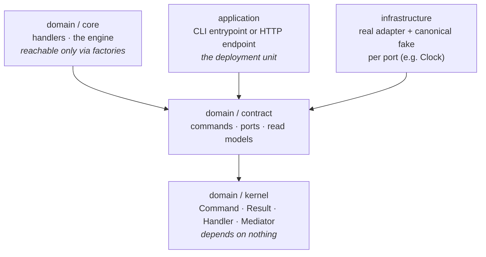

# Stack catalog

A **stack** is a curated greenfield preset: capability tags + verticals
that produce a coherent, runnable project. Pick one and run:

```sh
npx @rgoussu.dev/keel new --stack=<id>
```

Stacks are sugar over the [composition model](../composition.md) —
they spare you naming every tag and vertical by hand, nothing more.

## The matrix

| Language / framework   | CLI                    | HTTP service            | SPA              | Fullstack product     | Docs                                |
| ---------------------- | ---------------------- | ----------------------- | ---------------- | --------------------- | ----------------------------------- |
| Java · Quarkus 3       | `quarkus-cli`          | `quarkus-rest`          | —                | `fullstack`           | [JVM](jvm.md)                       |
| Kotlin · Quarkus 3     | `quarkus-cli-kotlin`   | `quarkus-rest-kotlin`   | —                | —                     | [JVM](jvm.md)                       |
| Java · Spring Boot 4   | `spring-cli`           | `spring-rest`           | —                | `fullstack-spring`    | [JVM](jvm.md)                       |
| Kotlin · Spring Boot 4 | `spring-cli-kotlin`    | `spring-rest-kotlin`    | —                | —                     | [JVM](jvm.md)                       |
| Java · Micronaut 4     | `micronaut-cli`        | `micronaut-rest`        | —                | `fullstack-micronaut` | [JVM](jvm.md)                       |
| Kotlin · Micronaut 4   | `micronaut-cli-kotlin` | `micronaut-rest-kotlin` | —                | —                     | [JVM](jvm.md)                       |
| Go · stdlib            | `go-cli`               | `go-http`               | —                | `fullstack-go`        | [Go](go.md)                         |
| Rust · stdlib / axum   | `rust-cli`             | `rust-http`             | —                | `fullstack-rust`      | [Rust](rust.md)                     |
| TypeScript · node:http | —                      | `ts-http`               | —                | `fullstack-ts`        | [ts-http](ts-http.md)               |
| TypeScript · web comps | —                      | —                       | `web-components` | frontend of all       | [web-components](web-components.md) |

The domain trisection is byte-for-byte identical across frameworks per
language — only the application layer and build wiring change. **The
conventions, not the framework, are the product.**

## What each shape installs by default

| Shape                             | Verticals installed at bootstrap                                                                                                                                                |
| --------------------------------- | ------------------------------------------------------------------------------------------------------------------------------------------------------------------------------- |
| CLI (`*-cli`)                     | [`vcs`](../verticals/vcs.md) · [`walking-skeleton`](../verticals/walking-skeleton.md)                                                                                           |
| HTTP service (`*-rest`, `*-http`) | [`vcs`](../verticals/vcs.md) · [`walking-skeleton`](../verticals/walking-skeleton.md) · [`dev-env`](../verticals/dev-env.md) · [`observability`](../verticals/observability.md) |
| SPA (`web-components`)            | [`vcs`](../verticals/vcs.md) · [`walking-skeleton`](../verticals/walking-skeleton.md)                                                                                           |
| Fullstack (`fullstack*`)          | each service's own defaults + [`gateway`](../verticals/gateway.md) per service; [`vcs`](../verticals/vcs.md) + [`fullstack`](../verticals/fullstack.md) at the monorepo root    |

More can be layered on afterwards with `keel add` — see the
[compatibility matrix](../verticals/README.md#compatibility-matrix).

## Prerequisites at a glance

keel itself needs **Node 22+** (it runs via `npx`). Each stack then
shells out to your local toolchain during the bootstrap — the exact
list, per stack, is on each stack page:

| Stack family                                      | Required on PATH                                                                |
| ------------------------------------------------- | ------------------------------------------------------------------------------- |
| [JVM](jvm.md#prerequisites)                       | `git`, JDK 25, and `gradle` _or_ `mvn` (the wrapper is generated, not vendored) |
| [Go](go.md#prerequisites)                         | `git`, `go` (runs `go mod tidy`)                                                |
| [Rust](rust.md#prerequisites)                     | `git`, `cargo` (runs `cargo check`)                                             |
| [ts-http](ts-http.md#prerequisites)               | `git`, Node 22.18+, `npm` or `pnpm` (runs the install)                          |
| [web-components](web-components.md#prerequisites) | `git`, Node 22+, `npm` or `pnpm` (runs the install)                             |
| [Fullstack](fullstack.md#prerequisites)           | union of both services; Docker (Compose) to run the container story             |

If a tool is missing, the corresponding deferred action fails with the
command it tried to run — nothing is silently skipped.

## Anatomy of a scaffolded service

Whatever the language, the shape is the same hexagon:



Per-language renderings differ where the language demands it (Go and
Rust hide the core behind compiler visibility instead of module
boundaries, and use per-use-case ports instead of a mediator object) —
each stack page shows the exact tree. The conventions themselves are
defined once, in the [binding spec](../../assets/project/AGENTS.md),
which every scaffolded project receives as its own `AGENTS.md`.
