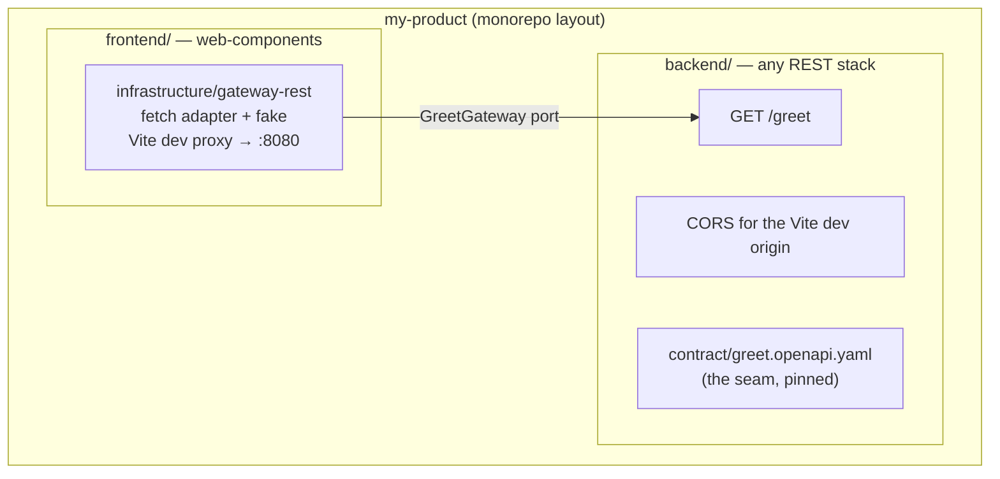

# Fullstack products

A fullstack stack is a **composite**: two complete keel services —
a REST backend and the [`web-components`](web-components.md) SPA —
scaffolded together and wired through the
[gateway seam](../verticals/gateway.md).

| Stack                 | Backend service            | Frontend service |
| --------------------- | -------------------------- | ---------------- |
| `fullstack`           | [`quarkus-rest`](jvm.md)   | `web-components` |
| `fullstack-spring`    | [`spring-rest`](jvm.md)    | `web-components` |
| `fullstack-micronaut` | [`micronaut-rest`](jvm.md) | `web-components` |
| `fullstack-go`        | [`go-http`](go.md)         | `web-components` |
| `fullstack-rust`      | [`rust-http`](rust.md)     | `web-components` |
| `fullstack-ts`        | [`ts-http`](ts-http.md)    | `web-components` |

All six select the **same** frontend gateway adapters, because the
seam is driven by peer tags, not by the backend's language or
framework — see
[peers in the composition model](../composition.md#peer-tags-and-products).

## How to

```sh
mkdir my-product && cd my-product
npx @rgoussu.dev/keel new --stack=fullstack                 # or any twin above
npx @rgoussu.dev/keel new --stack=fullstack-go --layout polyrepo
```

## Prerequisites

The union of both services' prerequisites — the backend's
([JVM](jvm.md#prerequisites) / [Go](go.md#prerequisites) /
[Rust](rust.md#prerequisites) / [ts-http](ts-http.md#prerequisites))
plus the frontend's
([web-components](web-components.md#prerequisites)) — and:

| Requirement                 | Why                                                               |
| --------------------------- | ----------------------------------------------------------------- |
| Docker + Compose (optional) | To run the monorepo container story: `docker compose up --build`. |

## What you'll be asked

The usual per-service answers, plus one product-level choice:

| Question          | Notes                                                                                                                                                                                                                           |
| ----------------- | ------------------------------------------------------------------------------------------------------------------------------------------------------------------------------------------------------------------------------- |
| Repository layout | `monorepo` (default): one repository, `backend/` + `frontend/` side by side, git initialised once at the root, a product README tying them together. `polyrepo`: a repository per service, no shared root. Pin with `--layout`. |

## What gets generated



- Each service is a **complete keel project** with its own manifest;
  each records the other as a **peer** (`peer.api.rest` /
  `peer.ui.spa`).
- The frontend gains an `infrastructure/gateway-rest` package — a
  fetch adapter + fake behind a `GreetGateway` driven port, with the
  Vite dev proxy pointed at `localhost:8080`.
- The backend gains CORS for the Vite dev origin, and owns the seam's
  OpenAPI document (`contract/greet.openapi.yaml`).
- The greet slice runs **end to end across both hexagons**.
- Monorepo products additionally get the
  [`fullstack`](../verticals/fullstack.md) root glue: a product README
  (service map, run order) and `compose.yaml` with a Dockerfile beside
  each deployment unit:

```sh
docker compose up --build
```

## Brownfield: wire two existing projects instead

You don't need the composite preset — the seam is addable after the
fact:

```sh
cd my-frontend && keel link ../my-backend
keel add gateway                              # frontend half of the seam
cd ../my-backend && keel add gateway          # backend half (CORS + contract)
```

## Related

- [Gateway vertical](../verticals/gateway.md) ·
  [Fullstack vertical (root glue)](../verticals/fullstack.md)
- [Composition model — composite stacks](../composition.md#composite-stacks)
