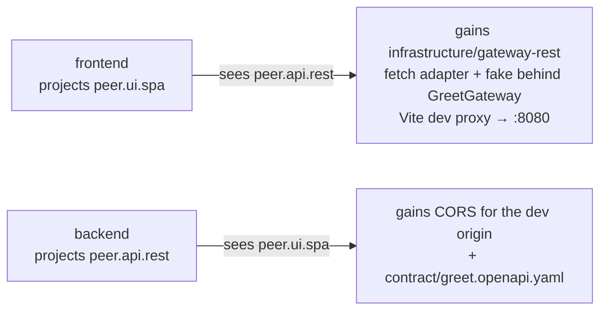

# `gateway` — the cross-service seam

Client gateways and server accommodations, selected purely by **peer
tags**. The vertical declares **no dimensions**: with no peers in
scope it installs nothing; with peers, each side gets its half of the
seam.

## How the seam works



The same frontend gateway adapter fires for **any** backend projecting
`peer.api.rest` — Quarkus, Spring, Micronaut, Go, Rust, or `ts-http` —
because the seam is driven by the projection, not the language. The
wire itself is pinned by an OpenAPI document the backend owns.

## Adapters

| Side     | Adapter                                                                                                                                       | Fires on                                     |
| -------- | --------------------------------------------------------------------------------------------------------------------------------------------- | -------------------------------------------- |
| Frontend | `gateway/wc-gateway-rest`                                                                                                                     | `framework.web-components` + `peer.api.rest` |
| Backend  | `gateway/quarkus-cors`, `gateway/spring-cors` (+ Kotlin), `gateway/micronaut-cors`, `gateway/go-cors`, `gateway/rust-cors`, `gateway/ts-cors` | the matching stack tags + `peer.ui.spa`      |
| Backend  | `gateway/rest-api-contract` — emits the seam's OpenAPI document                                                                               | `arch.server-http` + `peer.ui.spa`           |

## How to get it

**Composite stacks** ([fullstack products](../stacks/fullstack.md))
install it automatically on every service.

**Brownfield**, wire two existing keel projects:

```sh
cd my-frontend && keel link ../my-backend   # records the peer projection, both ways
keel add gateway                            # frontend half of the seam
cd ../my-backend && keel add gateway        # backend half (CORS + contract)
```

## Prerequisites

| Requirement                     | Why                                                       |
| ------------------------------- | --------------------------------------------------------- |
| Both projects are keel projects | Peer projections live in the keel manifests.              |
| `keel link` run first           | Without peer tags in scope the vertical installs nothing. |

## Related

- [Fullstack products](../stacks/fullstack.md) ·
  [Composition model — peer tags](../composition.md#peer-tags-and-products)
- [Verticals catalog](README.md)
